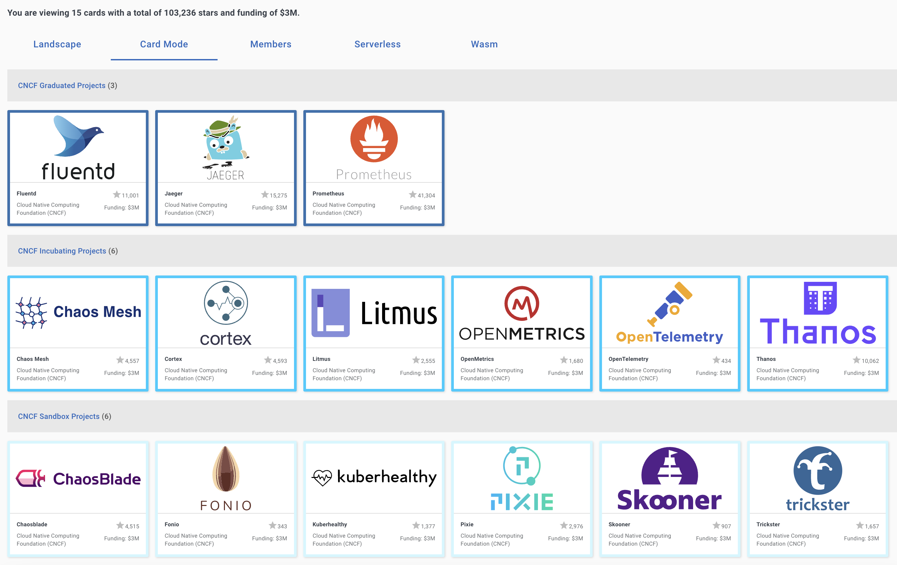

# CNCF TAG Observability 🔭⚙️

Technical Advisory Group for Observability under the umbrella of [CNCF](https://www.cncf.io/).

## Mission statement

TAG Observability focuses on topics pertaining to the observation of cloud native workloads. Additionally, it produces
supporting material and best practices for end-users and provides guidance and coordination for CNCF projects working within the TAG’s scope.

### Whitepaper

See our [latest 1.0 observability whitepaper](https://github.com/cncf/tag-observability/blob/whitepaper-v1.0.0/whitepaper.md) to kickstart your observability journey or enhance what you know so far! 💪🏽

[Contributions](./whitepaper.md) welcome to evolve it further.

### Scope

Excerpts from the [Observability Charter Document](observability-charter.md):

* Foster, review and grow the ecosystem of observability related projects, users, and maintainers in open source, cloud-native technology.
* Identify and report gaps in the CNCF's project portfolio on topics of observability to the TOC and the wider CNCF community.
* Collect, curate, champion, and disseminate patterns and current best practices related to the observation of cloud-native systems that are effective and actionable.
* Educate and inform users with unbiased, accurate, and pertinent information. Educate and help other CNCF projects regarding observability techniques and best current practices available within the CNCF.
* Provide and maintain a vendor-neutral venue for relevant thought validation, discussion, and project feedback.
* Provide a ladder for community members to become involved with the technical oversight of projects within the SIG's scope in an open, transparent, and inclusive way.

## How we communicate

* Chat: [CNCF Slack #tag-observability](https://slack.cncf.io)
* TAG meetings @ 1600 UTC, 1st and 3rd Tuesdays of each month
    * See [CNCF community calendar](https://www.cncf.io/community/calendar/) for invite links
    * [Meeting Notes](https://docs.google.com/document/d/1_QoF-njScSuGFI3Ge5zu-G8SbL6scQ8AzT1hq57bRoQ/edit)
* [In Progress Work](https://github.com/cncf/tag-observability/projects/1#card-36042463), Status, and Roadmap
* Mailing List: `cncf-tag-observability@lists.cncf.io` ([join here](https://lists.cncf.io/g/cncf-tag-observability))

## CNCF projects related to the TAG

[Interactive Landscape](https://landscape.cncf.io/card-mode?category=observability-and-analysis&project=graduated,incubating,sandbox)

## How to get involved

There are many ways you can join in to participate in the Observability TAG’s activities.

Great ways to get involved include
- Join our discussion channels on [CNCF Slack #tag-observability](https://slack.cncf.io)
- Join our [bi-monthly calls](https://www.cncf.io/community/calendar/) where observability experts and practitioners present on and discuss Observability topics
- Contribute to discussion threads on the O11y TAG [GitHub Issues](https://github.com/cncf/tag-observability/issues)
- Participate in O11y TAG workgroups including
    - [Observe K8s workgroup](https://github.com/cncf/tag-observability/blob/main/working-groups/observe-k8s.md)
    - [Observability Query Language Specification (QLS) workgroup](https://github.com/cncf/tag-observability/blob/main/working-groups/query-standardization.md)
- Come say Hi! at CNCF conferences including Kubecon NA, Kubecon EU and other open source conferences such as Open Source Summits.

If you would like to suggest a specific topic or action item, please determine if there are ongoing activities or prior art. Good starting points are our [GitHub Issues](https://github.com/cncf/tag-observability/issues), reports, or [meeting notes](https://docs.google.com/document/d/1_QoF-njScSuGFI3Ge5zu-G8SbL6scQ8AzT1hq57bRoQ/edit). 

If you want to propose new TAG activities or join in for existing ones, please take a look at our [Kanban Board](https://github.com/cncf/tag-observability/projects/1#card-36042463) or file a suggestion with a GitHub issue :-)

## Operations

### TOC Liaisons

| Name           | Email                     |  GitHub          | Company      |
| -------------- | ------------------------- | ---------------- | ------------ |
| Cathy Zhang    | cathy.h.zhang@intel.com   | [cathyhongzhang] | [Intel]      |
| Erin Boyd      | eboyd@redhat.com          | [erinaboyd]      | [Red Hat]    |
| Ricardo Rocha  | rocha.porto@gmail.com     | [rochaporto]     | [CERN]       |

### Chairs (alphabetical order)

| Name             | Email                      | CNCF Slack      | GitHub        | Company     | Open Source                        |
| ---------------- | -------------------------- | --------------- | ------------- | ----------- | ---------------------------------- |
| Alolita Sharma   | alolita.sharma@gmail.com   | @Alolita Sharma | [alolita]     | [Apple]     | [OpenTelemetry Team]               |
| Matt Young       | halcyondude@gmail.com      | @Matt Young     | [halcyondude] | [Apple]     |                                    |
| Richard Hartmann | richih@richih.org          | @RichiH         | [RichiH]      | [Grafana]   | [Prometheus Team]; [PromCon] Lead  |

### Tech Leads

| Name              | Email               | CNCF Slack  | GitHub     | Company   | Open Source                        |
| ----------------- | ------------------- | ----------- | ---------- | --------- | ---------------------------------- |
| Bartłomiej Płotka | bwplotka@gmail.com  | @bwplotka   | [bwplotka] | [Google]  |  [Prometheus Team]; [Thanos Team]; [Other][bwplotka-other] |

[Apple]:      https://opensource.apple.com
[Grafana]:    https://grafana.com
[Microsoft]:  https://www.microsoft.com
[Red Hat]:    https://redhat.com
[Google]:     https://about.google/
[OpenTelemetry Team]: https://github.com/open-telemetry/community/blob/main/community-members.md
[Prometheus Team]: https://prometheus.io/governance/#team-members
[Thanos Team]:     https://thanos.io
[bwplotka-other]:  https://www.bwplotka.dev/about/#open-source-projects
[PromCon]:         https://promcon.io
[CERN]:       https://home.cern
[Intel]:      https://www.intel.com

[alolita]:        https://github.com/alolita
[bwplotka]:       https://github.com/bwplotka
[halcyondude]:    https://github.com/halcyondude
[resouer]:        https://github.com/resouer
[RichiH]:         https://github.com/RichiH
[rochaporto]:     https://github.com/rochaporto 
[erinaboyd]:      https://github.com/erinaboyd  
[cathyhongzhang]: https://github.com/cathyhongzhang

## Governance

This TAG follows [the standard operating model provided by the TOC](https://github.com/cncf/toc/blob/master/tags/cncf-tags.md#operating-model).

## Code of Conduct

We follow the [CNCF](https://www.cncf.io/)'s [Code of Conduct](https://github.com/cncf/foundation/blob/master/code-of-conduct.md).  
