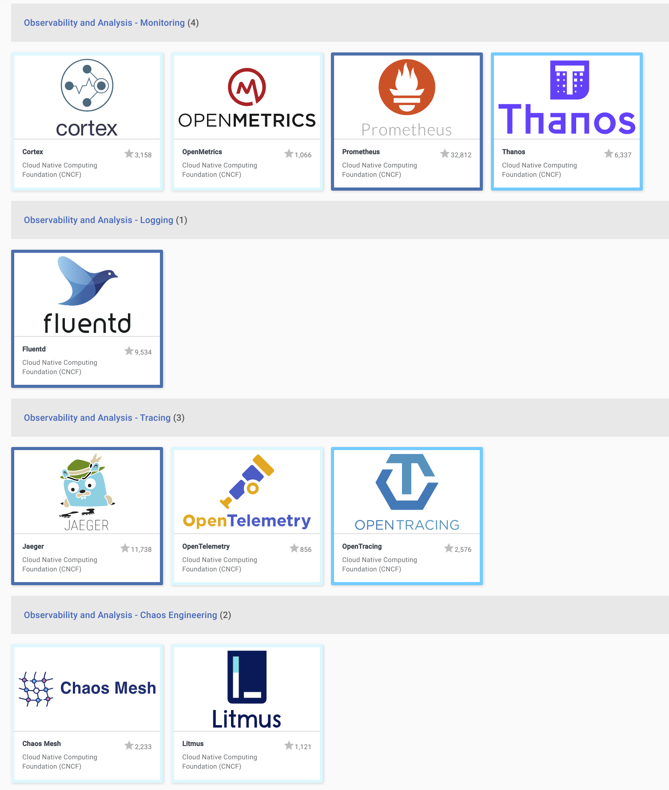

# CNCF TAG Observability 🔭⚙️

Technical Advisory Group for Observability under the umbrella of [CNCF](https://www.cncf.io/).

## Mission statement

The TAG Observability focuses on topics pertaining to the observation of cloud native workloads. Additionally, it produces
supporting material and best practices for end-users and provides guidance and coordination for CNCF projects working within the TAG’s scope.

### Scope

* Foster, review and grow the ecosystem of observability related projects, users, and maintainers in open source, cloud-native technology.
* Identify and report gaps in the CNCF's project portfolio on topics of observability to the TOC and the wider CNCF community.
* Collect, curate, champion, and disseminate patterns and current best practices related to the observation of cloud-native systems that are effective and actionable.
* Educate and inform users with unbiased, accurate, and pertinent information. Educate and help other CNCF projects regarding observability techniques and best current practices available within the CNCF.
* Provide and maintain a vendor-neutral venue for relevant thought validation, discussion, and project feedback.
* Provide a ladder for community members to become involved with the technical oversight of projects within the SIG's scope in an open, transparent, and inclusive way.

## Officially sanctioned information channels

* [Observability Charter Document](observability-charter.md)
* Forthnightly TAG calls @ 1600 UTC, see [CNCF community calendar](https://www.cncf.io/community/calendar/)
* [Meeting Notes](https://docs.google.com/document/d/1_QoF-njScSuGFI3Ge5zu-G8SbL6scQ8AzT1hq57bRoQ/edit)
* [In Progress Work Status and Roadmap](https://github.com/cncf/tag-observability/projects/1#card-36042463)
* Mailing List: `cncf-tag-observability@lists.cncf.io` ([join here](https://lists.cncf.io/g/cncf-tag-observability))
* Chat: [CNCF Slack #tag-observability](https://slack.cncf.io)

## CNCF projects related to the SIG

Interactive Landscape: [here](https://landscape.cncf.io/card-mode?category=observability-and-analysis&grouping=category&project=hosted)

## How to get involved

The best way to get involved is hanging around our channels of communication, joining our calls, and getting a feeling for how we operate.

If you want to tackle specific tasks, it's best to look at our [Kanban Board](https://github.com/cncf/sig-observability/projects/1#card-36042463) and pick out what you like.

If you want to suggest a specific topic or action item, please do some basic research if this topic has already been tackled, or is currently being worked on, in some form. Good starting points are our [GitHub Issues](https://github.com/cncf/sig-observability/issues), reports, or meeting notes. If in doubt, asking on Slack is a good first step.

## Operations

### TOC Liaison

| Name          | Email                        |  GitHub         | Company       |
| -------------- | --------------------------- | --------------- | ------------- |
| Lei Zhang      | `lei.zhang@alibaba-inc.com` | [resouer]       | [Alibaba]     |
| Cornelia Davis | `cornelia@weave.works`      | [cdavisafc]     | [WeaveWorks]  |

### Chairs (alphabetical order)

| Name                | Email                   | CNCF Slack    | GitHub        | Company     | Open Source                        |
|-------------------- | ----------------------- |-------------- | ------------- | ----------- | ---------------------------------- |
| Matt Young          | `halcyondude@gmail.com` | `@Matt Young` | [halcyondude] | [EverQuote] |                                    |
| Richard Hartmann    | `richih@richih.org`     | `@RichiH`     | [RichiH]      | [Grafana]   | [Prometheus Team]; [PromCon] Lead  |
| TBD                 |                         |               |               |             |                                    |

### Tech Lead

| Name              | Email               | CNCF Slack    | GitHub        | Company   | Open Source                        |
|------------------ | ------------------- |------------   |--------       | --------- | ---------------------------------- |
| Bartłomiej Płotka | bwplotka@gmail.com  | `@bwplotka`   | [bwplotka]    | [Red Hat] |  [Prometheus Team]; [Thanos Team]; [Other][bwplotka-other] | 

[EverQuote]: https://www.everquote.com
[Grafana]:   https://grafana.com
[Microsoft]: https://www.microsoft.com
[Red Hat]:   https://redhat.com
[WeaveWorks]: https://www.weave.works/
[Alibaba]: https://www.alibaba.com/

[Prometheus Team]: https://prometheus.io/governance/#team-members
[Thanos Team]: https://thanos.io
[bwplotka-other]:  https://www.bwplotka.dev/about/#open-source-projects
[PromCon]: https://promcon.io

[bwplotka]:      https://github.com/bwplotka
[resouer]: https://github.com/resouer
[cdavisafc]: https://github.com/cdavisafc
[halcyondude]:   https://github.com/halcyondude
[RichiH]:        https://github.com/RichiH

## Governance

This TAG follows [the standard operating model provided by the TOC](https://github.com/cncf/toc/blob/master/sigs/cncf-tags.md#operating-model).

## Code of Conduct

We follow the [CNCF](https://www.cncf.io/)'s [Code of Conduct](https://github.com/cncf/foundation/blob/master/code-of-conduct.md).
