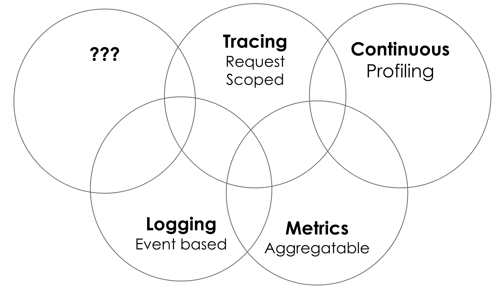

# CNCF Observability Knowledge Entry Point

This page is a community-driven **entry point** for tutorials, guides, blog posts and documentation related to the observability problems that the CNCF project
aim to solve. Use this document if you wish to learn more about [the observability projects we have in the CNCF landscape][projects] by
navigating to the section that is relevant to the topic you are trying to search answers for.

See [How To Contribute Section](#how-to-contribute) if you cannot find the answer to your observability question and topic or
you found something outdated.

You can treat this as certain FAQ. Ideally all the topics and questions presented here, are being explained well
in each related project's documentation. 

## Content

  - [Content](#content)
  - [How To Contribute?](#how-to-contribute)
    - [Process of editing this page](#process-of-editing-this-page)
    - [Process of signaling something missing or outdated](#process-of-signaling-something-missing-or-outdated)
  - [Observability Signals](#observability-signals)
    - [Metrics](#metrics)
    - [Logging](#logging)
    - [Tracing](#tracing)
    - [Continuous Profiling](#continuous-profiling)
  - [CNCF Projects](#cncf-projects)
    - [Cortex](#cortex)
    - [Fluentd](#fluentd)
    - [Jaeger](#jaeger)
    - [Litmus](#litmus)
    - [OpenMetrics](#openmetrics)
    - [OpenTelemetry](#opentelemetry)
    - [OpenTracing](#opentracing)
    - [Prometheus](#prometheus)
      - [Instrumenting Your Application With Metrics](#instrumenting-your-application-with-metrics)
        - [Granularity](#granularity)
        - [Label vs Metric](#label-vs-metric)
    - [Thanos](#thanos)
  - [Maintainers of this page](#maintainers-of-this-page)

<!-- Created with https://luciopaiva.com/markdown-toc/ -->

## How To Contribute?

This **entry point** is community-driven, so anyone is welcome to propose changes here.
Especially if you maintain an Observability related project, please help by mentioning useful links to the 
up to date documentation.

### Process of editing this page

* Create a [PullRequest](https://opensource.com/article/19/7/create-pull-request-github) with edits.
  * Make sure to link to up to date documentation and sources.
  * (optionally) Add yourself as [author / maintainer of this page](#maintainers-of-this-page) if you want.
* Ping [maintainers of this page](#maintainers-of-this-page) for review or/and add an agenda item on SIG Observability meetings.
* Address comments from reviews.

### Process of signaling something missing or outdated

* Add issue to this repo with an explanation of what you would like to see fixed or updated. 

## Observability Signals

[TBD, help wanted!](#how-to-contribute)

Generally, we can divide observability space into few signals that allow getting an insight into your applications state
and health running in the cloud. This list is not exhaustive. There is room for more signals to be invented with time.

(Diagram based on [following blog post][signals-blog-post])

### Metrics

[TBD, help wanted!](#how-to-contribute)

### Logging

[TBD, help wanted!](#how-to-contribute)

### Tracing

[TBD, help wanted!](#how-to-contribute)

### Continuous Profiling

[TBD, help wanted!](#how-to-contribute)

## CNCF Projects

There are a few projects related to the Observability space, as seen on the CNCF [landscape][projects]. This section
provides an entry point if you want to learn more about any. In alphabetical order:

### Cortex

[TBD, help wanted!](#how-to-contribute)

Documentation is available [here](https://cortexmetrics.io/docs/)

### Fluentd

[TBD, help wanted!](#how-to-contribute)

Documentation is available [here](https://docs.fluentd.org/)

### Jaeger

[TBD, help wanted!](#how-to-contribute)

Documentation is available [here](https://www.jaegertracing.io/docs/1.18/)

### Litmus

[TBD, help wanted!](#how-to-contribute)

Documentation is available [here](https://docs.litmuschaos.io/docs/getstarted/)

### OpenMetrics

[TBD, help wanted!](#how-to-contribute)

Documentation is available [here](https://openmetrics.io/)

### OpenTelemetry

[TBD, help wanted!](#how-to-contribute)

Documentation is available [here](https://opentelemetry.io/docs/)

### OpenTracing

[TBD, help wanted!](#how-to-contribute)

Documentation is available [here](https://opentracing.io/docs/)

### Prometheus 

Prometheus is a single binary capable to collect, store, query and alert on your applications' metrics.
It is designed for real time alerting and monitoring, with strong reliability guarantees. It has its own
time series database build-in, allowing persistence across restarts and integrations with numerous external systems
including CNCF [Cortex](#cortex), [Thanos](#thanos) and more. 

Documentation is available [here](https://prometheus.io/docs/introduction/overview/)
Best practices:

* [Zen of Prometheus][zen-of-prom]

[zen-of-prom]: https://the-zen-of-prometheus.netlify.app/
 
#### Instrumenting Your Application With Metrics

##### Granularity

As asked [here](https://github.com/cncf/sig-observability/issues/18#issue-651759365), how much of cardinality is too much?

Overall it depends on how you or other users plan to use those metrics, particularly what questions you will be asking your monitoring system.
In terms of metrics, questions should be mostly around aggregated values over time like max, min, sum or avg.

The amount of cardinality essentially depends on how much you want to pay for running Prometheus vs how many dimensions you want to your aggregate on.
Usually it means avoiding unique, frequently changing info like IDs, IPs, user names, or error strings, so generally values with unbounded uniqueness. 
Those are usually related to events, so logs or traces are more suitable to track each of those. The rule of thumb is checking if you can specify all
possible values for such a label in programmatic `constant`. If because of the dynamic you cannot, it most likely should not be a metric.

In terms of errors, there is still big value in knowing the "type" of error. Was it transient? Was it user error? Server error? Timeout? 
It's very common to have a label for error type to at least have graphs showing the high-level reason like HTTP status code.

##### Label vs Metric

As asked [here](https://github.com/cncf/sig-observability/issues/18#issue-651759365), for example should 
`flux_daemon_synced_manifests_total` be a single metric with the `status` label? Or should it be split in two; `flux_daemon_synced_manifests_failures_total`
 and `flux_daemon_synced_manifests_success_total`?
 
The rule of thumb is to ask yourself a question: Would you need to group the aggregations across those labels? If yes, put it in the label, if no then the metric name is fine.
Remember that a new label means a bigger index, so some overhead and cost again. 

### Thanos

[TBD, help wanted!](#how-to-contribute)

Documentation is available [here](https://thanos.io/getting-started.md/)

## Maintainers of this page

* [bwplotka](https://github.com/bwplotka)

[projects]: https://landscape.cncf.io/category=observability-and-analysis&format=card-mode&grouping=category&project=
[signals-blog-post]: https://peter.bourgon.org/blog/2017/02/21/metrics-tracing-and-logging.html